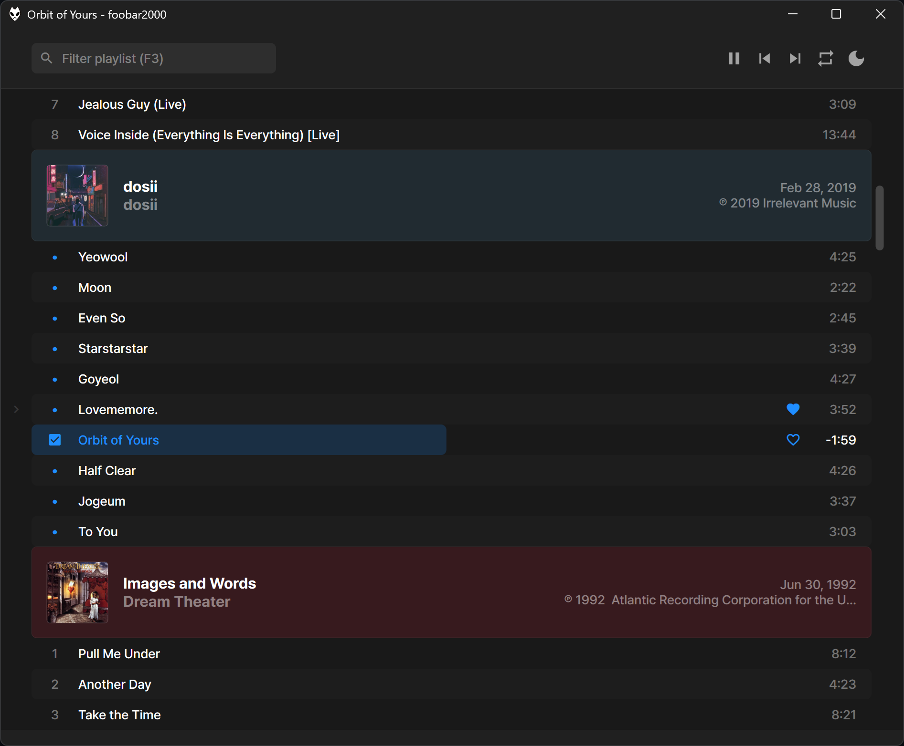
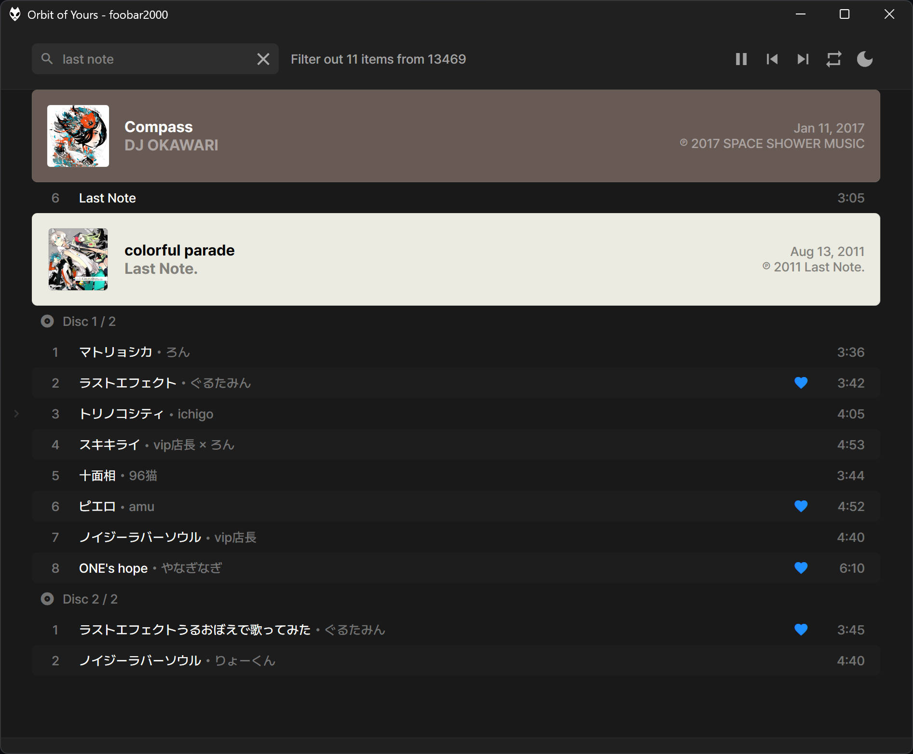
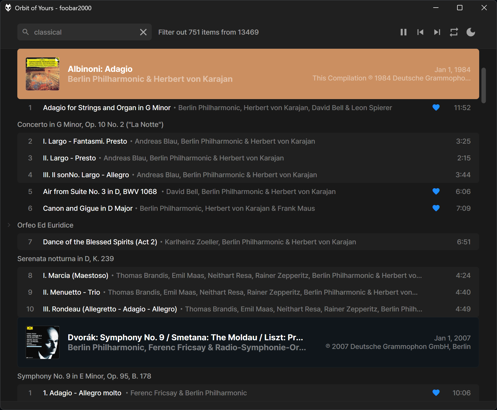

Smooth Playlist Modded, hosted by JScript Panel 3.

## Requirements

* [JScript Panel 3](https://hydrogenaudio.org/index.php/topic,110516.msg1067716.html#msg1067716)
* [Material Icons](https://fonts.google.com/download?family=Material%20Icons)
* [Playback Statistics](https://www.foobar2000.org/components/view/foo_playcount) (optional)
* [Columns UI](https://yuo.be/columns-ui) (optional)
* [Openhacks](https://github.com/ttsping/foo_openhacks/releases) (optional for DUI)
* [PretendardJP Font](https://github.com/orioncactus/pretendard/releases) for CJK users (recommended)

## Installation

Just load **profile/user-scripts/Smooth Playlist.txt** in JSP3 panel

## Key Features

1. Mark **recently added (1 week)** with dot


2. Subgroupping with disc number


3. Subgroupping for classical genre

```
How it works?

Simply splitting %title% contains delimeter colon which %genre% is "classical" or "クラシック"
```

## Shortcuts

1. <kbd>F3</kbd> Focus on filtering inputbox
2. <kbd>F5</kbd> Rebuild cover cache
3. <kbd>Space</kbd> Play/Pause
4. <kbd>←</kbd> Seek back 5 seconds
5. <kbd>→</kbd> Seek forward 5 seconds
6. <kbd>Tab</kbd> Toggle left panel (playlist manager/playback history)
7. <kbd>Ctrl</kbd>+<kbd>B</kbd> Toggle dynamic group background colour
8. <kbd>Ctrl</kbd>+<kbd>D</kbd> Toggle doubled row height
9. <kbd>Ctrl</kbd>+<kbd>E</kbd> Toggle row stripes
10. <kbd>Ctrl</kbd>+<kbd>G</kbd> Toggle group header
11. <kbd>Ctrl</kbd>+<kbd>R</kbd> Toggle rounded corner style
12. <kbd>Ctrl</kbd>+<kbd>Wheel</kbd> Scale UI (based on font size which is hard coded in scripts, by default 10)
13. <kbd>Ctrl</kbd>+<kbd>0</kbd> Reset scale to default (font size 10)
14. <kbd>Alt</kbd> Toggle menu bar (foo_openhacks is required for DUI)
15. <kbd>Wheel</kbd> on header bar to change volume
16. Double left click on header bar to jump to playing item

## Notes

1. Heart Icon represents rating is 5
2. Switching dark/light button is only available in CUI mode
3. Live streaming playback is not considered in this theme
4. Highlight colour in CUI is [Inactive select item foreground]
